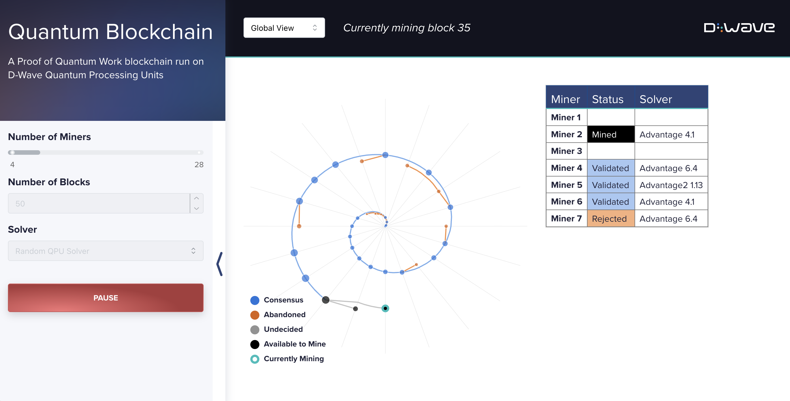

[](
  https://codespaces.new/dwave-examples/quantum-blockchain?quickstart=1)

# Proof of Quantum Work Blockchains

Ledgers are widespread record keeping structures. A proof of work blockchain is a ledger supported
by consensus mechanisms to ensure that no single authority is required to verify the ledger.
Cryptographically-linked hard problems are solved by miners to encode new transactions.
Transactions can be considered finalized in the ledger because the community is incentivized by consensus mechanisms to behave honestly, and any attacker must out-work this majority to manipulate the ledger.

The proof of quantum work blockchain demonstrated in this example, works similarly to Bitcoin [[1]](#arXiv_2503_14462), but replaces the hard problem of finding rare SHA256 hashes with the problem of finding quantum experiments consistent with rare statistics. The particular quantum experiments can be chosen to be beyond-classical, so that only quantum computers can participate [[2]](#10.1126/science.ado6285).

In this example, a blockchain evolution is simulated by fixing the number of miners, depth of the chain, and computational context (the set of QPUs available to the miners).
Consensus on the state of the chain from the perspective of mining participants is presented.




## Installation
You can run this example without installation in cloud-based IDEs that support the
[Development Containers Specification](https://containers.dev/supporting) (aka "devcontainers")
such as GitHub Codespaces.

For development environments that do not support `devcontainers`, install requirements:

```bash
pip install -r requirements.txt
```

If you are cloning the repo to your local system, working in a
[virtual environment](https://docs.python.org/3/library/venv.html) is recommended.

## Usage
Your development environment should be configured to access the
[Leap&trade; quantum cloud service](https://docs.dwavequantum.com/en/latest/ocean/sapi_access_basic.html).
You can see information about supported IDEs and authorizing access to your Leap account
[here](https://docs.dwavequantum.com/en/latest/ocean/leap_authorization.html).

Run the following terminal command to start the Dash application:

```bash
python app.py
```

Access the user interface with your browser at http://127.0.0.1:8050/.

The demo program opens an interface where you can configure problems and submit these problems to
a solver.

Configuration options can be found in the [demo_configs.py](demo_configs.py) file.

> [!NOTE]\
> If you plan on editing any files while the application is running, please run the application
with the `--debug` command-line argument for live reloads and easier debugging:
`python app.py --debug`

Tests can be run by running

```bash
pytest -k "test" 
```
from the quantum-blockchain/tests directory.


# Problem Description

This demo implements a simplified version of a blockchain with adherence of miners to the blockchain rules. Modeling of transactions and passive (non-mining) stakeholders is omitted - this does not impact the evolution of the blockchain. Networking delays are not modeled, and miners use identical (by default distributed) computing resources.

Miners demonstrate completion of quantum work by performing experiments parameterized by the state of the blockchain. Experimental results (sample sets) are post-processed to pairwise correlation statistics. Correlations realized by a particular experiment define a point in a high dimensional space; a miner must find experimental parameters such that this point falls in a small subspace. Miners search by varying a nonce parameter, which controls the parameters of the unitary evolution and post-processing. Statistics can be digitalized to produce a hash. Any other miner can rerun the experiment to verify a claim of work, up to control and sampling errors. The process of generating a hash is demonstrated below.


Miners present work subject to statistical uncertainty, their work is not guaranteed to be accepted by the community. Consensus mechanisms ensure that such uncertainty is resolved subject to a delay, so that the state of the ledger can be confidently asserted. An example of how probabilistic verification impacts the state of the chain is shown below. 
Consensus mechanisms guarantee that such disagreements are short lived, and there is only ever uncertainty on the status of very recently proposed blocks.


This demo implements a quantum blockchain wherein a set of miners perform quantum experiments on a set of QPUs (and embeddings), yet arrive at a consensus on experimental outcomes and the state of the ledger.
After setting parameters in the browser, the blockchain is initiated with a genesis block.
As blocks are mined and proposed they are assessed independently by miners conducting their own quantum experiments.

This example implements methods found in the paper, “Blockchain with Proof of Quantum Work” [[1]](#arXiv_2503_14462), where D-Wave executes the first-ever demonstration of distributed quantum computing deployed blockchain across four cloud-based annealing quantum computers in Canada and the United States. The research highlights how D-Wave built and tested a “proof of quantum” algorithm that uses quantum computation to generate and validate blockchain hashes. The resulting techniques demonstrated that D-Wave’s quantum blockchain architecture could enhance security and significantly reduce electricity costs.


### Comparison with Amin et al. Blockchain with Proof of Quantum Work [[1]](#arXiv_2503_14462)

The simulations in this example execute unitary evolutions on cubic spin glasses matching the paper, subject to changes in the generally available solvers.
The hash length is fixed to 64 and `num_reads` to 600 in order to reduce the QPU access time and accelerate the blockchain evolution (as opposed to the standardized 1 second of QPU access time in the [[1]](#arXiv_2503_14462) experiments).

The blockchain demo uses confidence-based Chainwork. We choose the quantum hash length as 64, and Nmax (called ALLOWABLE_ERROR in demo) to be 1, which allows comparison to the paper statistics demonstrating high efficiency and small delay if we account for changes to the compute environment. Experiments determine the witness uncertain (due to sampling and control errors at 1 second of QPU access time) to be 0.16 with the current set of generally available QPUs (January 2026). The discrepancy between generally available QPUs was larger (0.18) for the generally available QPUs in the paper experiments. Furthermore number of reads is reduced in the demo (enhancing witness uncertainty). A new default for the dW parameter is set accordingly, matching the paper methods. Finally, to allow for easier debugging and repeatability of trials, the hash definition in the demo has been modified to remove dependence on the block timestamp (which is still recorded, just unused). This should not alter the expected experimental outcomes in any way, as previous hash values and random nonce choices easily offer sufficient entropy to robustly explore the space of potential outcomes.

Problem-Hamiltonian and/or annealing rescaling allows one processor to emulate another, accommodating differences in the annealing schedules (energy scales). In both the paper and demo the target unitary evolution is defined relative to the Advantage2_prototype2 solver schedule.  Advantage systems modeled this schedule in the paper by lengthening their anneal times, to emulate the higher energy scales of Advantage2, which is also true in the demo. However, Advantage2 solvers (unavailable at the time of the original study) can have higher energy scales than the prototype system and emulation of the unitary dynamics must be achieved by scaling down of the problem Hamiltonian (since we cannot reduce annealing_time beyond the lower bound of [currently 5 nanoseconds]).
Visualization of the blockchain in the paper placed blocks sequential on a spiral, in the demo visualization the strongest chain follows the same parametric spiral, but other (non-strongest, or rejected) branches deviate inwards from that path. Whereas the paper included 4-color global views, the demo also allows 2-color presentations of the state from an individual miner perspective.

The delay and efficiency of quantum blockchains was evaluated in the paper, in part, by use of bootstrapping statistics. The same methods can be implemented in the context of this demo by enabling HIDE_SIMULATED_SOLVERS=False in the demo_configs.py file.

## Model and Code Overview

### Parameters
The demo defines the following parameters for the underlying proof-of-work protocol

* Number of miners: The number of participating miners.
* The length of the chain: the number of blocks that will be mined before the simulation stops.
* The set of QPUs used: One can select a single generally available QPU or all available QPUs. 

The simulation can be run, paused, and reset at fixed parameters.

### Initialization

The user selects the number of participating miners, the number of mining events to simulate,
and a set of QPUs (single or multiple). If multiple QPUs are selected, each experiment selects the QPU uniformly from the available QPUs. Each QPU supports a large set of programmings (differing in control error), which are also sampled uniformly at random on every evaluation. Experimental outcomes are subject to control and sampling errors.

### Mining and Validation

For each round of mining, one miner is randomly selected to be the 'winner' of that round,
simulating a distributed community with competitive mining where each miner has an equal chance
of winning. The winning miner completes a quantum experiment of sufficient confidence, creates a hash, and publishes a block.
Each unsuccessful miner validates the block and adjusts their pattern of mining based on the validation.
As this process iterates a panel is updated to demonstrate verification patterns.
A central graphic showing the state of the chain is updated showing either a single miner view
or the global view. The genesis block is placed at the center, with blocks spiraling outward in the order of proposal.

### Miner Blockchain View

The outer blue path representing the strongest chain, with other proposals marked in orange.
A miner can trust that the initial part of their strongest chain is immutable with high probability [[1]](#arXiv_2503_14462).
Transactions in this portion of the chain can be trusted, with some lower confidence in finality for the final few blocks.

### Global Blockchain View

The user can can select a global view that shows the consistency amongst the various miners.
Blocks that are finalized for all miners are marked blue. Blocks that are rejected by all users are marked orange.
Gray and black blocks have disputed status, with black blocks being actively mined by at least one miner (only black blocks have potential for further branching).
The efficiency is determined by the proportion of blue blocks, which should be large.
The delay is determined by the number of grey and black blocks, which indicate blocks whose validity is currently contested by miners.


### Quantum Unitary Evolution and the Quantum Hash

The unitary evolution that defines "the quantum puzzle", is defined by a set of programmable couplers, J, cryptographically determined by the strongest block (the block defining maximum chain work).
Each coupler is sampled uniformly at random +/- J for each edge matched to a 4x4x4 dimerized cubic lattice, with the desired evolution defined by a 5ns quench on the Advantage2_prototype2 system.
For other annealing QPUs to emulate the Advantage2_prototype2 schedule it is necessary to perform time energy rescaling (i.e. the rescaling of the problem Hamiltonian and annealing time is device specific with values precalculated).
A dimerized cubic lattice is a simple cubic lattice in which each node is replaced by a pair of nodes.
Miners access QPUs uniformly at random from the specified QPUs.
The QPU sampling makes use of the Ocean&trade; SDK composites framework with parallel embedding,
automorphism, and spin-reversal transform (SRT) averaging. The use of automorphism and SRT averaging,
enhances (relative) control errors, simulating variability that may exist across a more diverse ecosystem of QPUs.

After the sampleset is collected, it is post-processed to nearest neighbor correlations. These correlations are then randomly projected by normally distributed random vectors, to give witnesses. The sign on the witnesses specify the bits of the quantum hash.


### Per-QPU One-Time Calibration:

The unitary evolution is adjusted by selection of a QPU-specific energy-time
rescaling and embedding, precalculated for a restricted set of available solvers.

A new online solver specified by name solver_name, or a change of a processor graph, typically dictates the creation of new embeddings as one time work. This can be done by running
```bash
python get_qpu_embeddings.py -Q solver_name
```
Embeddings are automatically saved to a location suitable for use by the demo.

Different solvers are characterized by different energy scales. In order for a solver to emulate a reference unitary dynamics it is possible to either rescale upwards the time (if the energy scale is too low), or scale down the problem Hamiltonian (if the energy scale is too high). Estimates are determined by using
```bash
python get_qpu_energy_time_rescaling.py -Q solver_name
```
Function customizations can be listed using the --help flag.

In order to access a new solver in the demo:
1. The solver_name should also be enumerated as a SOLVER in src/protocols/hash_calculator.py
2. The solver_name and energy-time rescaling tuple should be added as a key-value pair to DEFAULT_ENERGY_TIME_RESCALING dictionary in src/values.py .

### Repeatability of Trials:

The demo uses NumPy random generator objects for all implementations of pseudorandom number generation. All generator functions use seed values descending from the RANDOM_SEED parameter found in demo_configs.py; setting the seed to a value other than 'None' before running the demo will cause
all trials to use that seed. This will cause things like mining order, solver choices and nonce values to repeat from one trial to the next. Likewise it will cause those portions of the quantum hash algorithm that rely on pseudorandom number generation to repeat. However, measurements taken by the QPU will still be subject to the inherent randomness of quantum phenomena. This is because QPU measurements dictate block scores which in turn dictates where miners choose to mine, so even two trials with identical initialization parameters and the same pseudorandom seed may have their blockchain structures diverge significantly. Trials can only be fully repeatable if run using simulated QPU solvers (setting `HIDE_SIMULATED_SOLVER = False` in demo_configs.py and choosing "Simulated Solver" in the interface) and all other settings must be identical. As repeating trials (wholly or partially) is not always desired behavior, setting RANDOM_SEED to `None` will initialize the NumPy generator objects with a randomly-chosen seed which will differ from trial to trial. However, the value of the seed used for any such trial can still be captured from the Trial ID, described below.

### Trial IDs and Reinitialization:

All of parameters necessary to fully characterize a single trial (as it begins) can be compressed into a single 22-digit hexadecimal number, allowing trials to be compared and repeated more easily. This number can be composed from the internal state of a TrialManager object by calling the `get_trial_id()` function found in src/protocols/trial_identification.py, and can be turned back into a complete dictionary of initialization parameters for TrialManager by calling the `get_trial_params_from_id()` function in the same file. However, this functionality cannot currently be accessed automatically through the Dash interface, and its use is mostly limited to debugging and helping organize trial data. The Trial ID for any trial run will be printed to the console, where it can be read, copied or stored. Note that identical Trial IDs don't ensure two trials will be fully repeatable if they are using QPU solvers (see Repeatability of Trials above).

### Adjusting Settings and Parameter Values

Adjustable settings and parameter values that are reasonably easy to understand and safe to change are located in 'demo_configs.py'. Parameters found outside this file are likely to cause serious issues if changed, and should only be altered by an experienced programmer who is already familiar with the code in the repository. Documentation within 'demo_configs.py' will generally indicate reasonable values and supported ranges; many values can be changed outside these ranges, but doing so is more likely to produce undesired behavior. Read below for a detailed description of the considerations of adjusting various parameter values.

#### Adjusting UI Input Elements

The section of 'demo_configs.py' under the header "Sliders, Buttons, and Option Entries" allows the basic parameters of the UI input elements to be altered, such as the range of the miner slider or the step size for the block selector. None of these should cause the demo to break if changed within the supported range, but some setting values may cause inconveniences or performance issues. In particular, the miner slider allows controlling the number of miners in each run and the block input allows for controlling the number of blocks. Together, these parameters determine how long a given simulation will take and how many QPU calls it will expend. For each block mined, each validating miner must make a single QPU call. Under default settings the mining miner will usually also make 1 call (but see the information on N_ZEROES in the next section). Each mining or validation event will generally take around 1.1 seconds to complete, so the overall time to complete a trial will generally go as 1.1 x miners x blocks. This means that, for example, a trial with 50 miners and 200 blocks will likely take at least 3 hours to run to completion (and result in 1000 QPU calls). For this reason, keeping the number of miners limited is recommended for most use-cases: in the range of 7-15 miners is generally sufficient to see interesting behaviors without unduly slowing down the simulation on increasing the cost. The other UI configurations are more straightforward: the 'NUM_MINER_VIEWS' parameter increase the number miners whose blockchain graphs are available to view, the 'HIDE_SIMULATED_SOLVERS' flag allows access to the simulated versions of QPU solvers (mostly useful for testing and debugging), and the 'MINER_NAMES' list allows miner names to be altered from their generic defaults of "MINER_1, MINER_2" and so on.

#### Adjusting Mining Difficulty

The section of 'demo_configs.py' under the header "Mining Difficulty Parameters" includes constants that alter the difficulty of mining. The first two parameters, QUANTUM_HASH_LENGTH and ALLOWABLE_ERR control the quantum hash length and the error allowance and collectively determine how likely the average block is to pass validation. To validate a block, a validator must agree on nearly every bit of the quantum hash with a number of disagreements no greater than the error allowance. The longer the hash is, the more bit errors it is likely to contain, so increasing the length will make validation failures more likely, unless the error allowance is increase proprtionally to compensate. Finally, the N_ZEROES parameter determines what fraction of valid quantum hashes produce a valid classical hash. For its default value of 0, every valid quantum hash found will produce a valid block, maximizing the mining rate. In a real-world context, a higher value for this parameter would be important to slow down the mining rate. However, for this simulation there's no advantage to a slower mining rate, so leaving this value at 0 is recommended for almost all use-cases. If it is set above 0, each mining event will take more time and use more QPU calls, slowing down the simulation somewhat. For structural reasons, the maximum supported value is 255, but the exponential slowdown of mining and a built-in timeout will generally stop values above 10 or 12 from being practically useful.

## References

<a id="arXiv_2503_14462"></a>
Blockchain with proof of quantum work
Mohammad H. Amin el al., arXiv:2503.14462 (2025)
https://arxiv.org/abs/2503.14462

<a id="10.1126/science.ado6285"></a>
Beyond-classical computation in quantum simulation
Andrew D. King et al., Science (2025)
https://doi.org/10.1126/science.ado6285

## License

Released under the Apache License 2.0. See [LICENSE](LICENSE) file.
