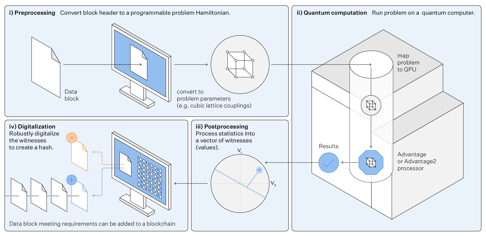
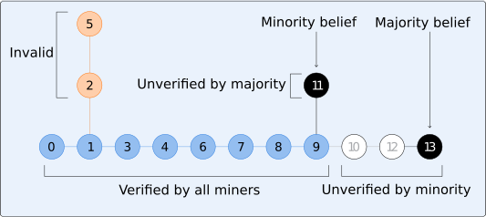

[](
  https://codespaces.new/dwave-examples/quantum-blockchain?quickstart=1)
[](
  https://circleci.com/gh/dwave-examples/quantum-blockchain)

# Proof of Quantum Work Blockchains

Ledgers are widespread record keeping structures.
A proof of work blockchain is a ledger supported by concensus mechanisms to ensure that no single authority is required to verify the ledger.
Cryptographically-linked hard problems are solved by miners to encode new transactions.
Transactions can be considered finalized in the ledger because the community is incentived by concensus mechanisms to behave honestly, and any attacker must out-work this majority to manipulate the ledger.
The proof of quantum work blockchain we demonstrate works similarly to Bitcoin[[1]](#arXiv:2503.14462), but replaces the hard problem of finding rare SHA256 hashes with the problem of finding quantum experiments consistent with rare statistics. The particular quantum experiments can be chosen to be beyond-classical, so that only quantum computers can participate Bitcoin[[2]](#10.1126/science.ado6285)

Fixing the number of miners, depth of the chain and computational context (the set of QPUs available to the miners) a blockchain evolution is simulated.
Concensus on the state of the chain from the perspective of mining participants is presented. Below is an example output of the program:

<a id="plot"></a>
  # TO DO, SUITABLE 4-QPU CHAIN


## Installation
You can run this example without installation in cloud-based IDEs that support the
[Development Containers Specification](https://containers.dev/supporting) (aka "devcontainers")
such as GitHub Codespaces.

For development environments that do not support `devcontainers`, install requirements:

```bash
pip install -r requirements.txt
```

If you are cloning the repo to your local system, working in a
[virtual environment](https://docs.python.org/3/library/venv.html) is recommended.

## Usage
Your development environment should be configured to access the
[Leap&trade; quantum cloud service](https://docs.dwavequantum.com/en/latest/ocean/sapi_access_basic.html).
You can see information about supported IDEs and authorizing access to your Leap account
[here](https://docs.dwavequantum.com/en/latest/ocean/leap_authorization.html).

Run the following terminal command to start the Dash application:

```bash
python app.py
```

Access the user interface with your browser at http://127.0.0.1:8050/.

The demo program opens an interface where you can configure problems and submit these problems to
a solver.

> [!NOTE]\
> If you plan on editing any files while the application is running, please run the application
with the `--debug` command-line argument for live reloads and easier debugging:
`python app.py --debug`

Tests can be run by running

```bash
pytest -k "test" 
```
from the quantum-blockchain/tests directory.


# Problem description

This demo implements a simplified version of a blockchain with adherence of miners to the blockchain rules. Modeling of transactions and passive (non-mining) stakeholders is omitted - this does not impact the evolution of the blockchain. Networking delays are not modeled, and miners use identical (by defaulted distributed) computing resources -- with these assumptions in place the evolution rate, but not structure becomes dependent on the parameters so that we can select a hardness threshold to be minimal so as not to waste QPU resources.

Miners demonstrate completion of quantum work by performing experiments parameterized by the state of the blockchain. Experimental results (sample sets) are post-processed to pairwise correlation statistics. Correlations realized by a particular experiment define a point in a high dimensional space, a miner must find experimental parameters such that this point falls in a small subspace. Miners search by varying a nonce parameters, which change the parameters of the unitary evolution and post-processing. Statistics can be digitalized to produce a hash. Any other miner can rerun the experiment to verify a claim of work, up to control and sampling errors. The process of generating a hash is demonstrated below.



Miners present work subject to statistical uncertainty, their work is not guaranteed to be accepted by the community. Concensus mechanisms ensure that such uncertainty is resolved subject to a delay, so that the state of the ledger can be confidently asserted. An example of how probabilistic verification impacts the state of the chain is shown below. 
Consensus mechanisms guarantee that such disagreements are short lived, and there is only ever uncertainty on the status of very recently proposed blocks.



This demo implements a quantum blockchain wherein a set of miners perform quantum experiments on a set of QPUs (and embeddings), yet arrive at a consensus on experimental outcomes and the state of the ledger.
After setting parameters in the browser, the blockchain is initiated with a genesis block.
As blocks are mined and proposed they are assessed independently by miners conducting their own quantum experiments.

In the paper, “Blockchain with Proof of Quantum Work” [[1]](#arXiv:2503.14462) D-Wave executed the first-ever demonstration of distributed quantum computing deployed blockchain across four cloud-based annealing quantum computers in Canada and the United States. The research highlights how D-Wave built and tested a “proof of quantum” algorithm that uses quantum computation to generate and validate blockchain hashes. The resulting techniques demonstrated that D-Wave’s quantum blockchain architecture could enhance security and significantly reduce electricity costs. This demo implements the methods of the paper.


### Comparison with Amin et al. Blockchain with Proof of Quantum Work [[1]](#arXiv:2503.14462)

The simulations of the demo execute unitary evolutions on cubic spin glasses matching the paper with simple +/- chain work, but subject to changes in the generally accessible solvers.
The hash length is fixed to 32 and num_reads to 600 (as opposed to the standardized 1 second of QPU access time in [[1]](#arXiv:2503.14462) experiments) in order to reduce the QPU access time per experiment (and accelerate the blockchain evolution).

### Parameters
The demo defines the following parameters for the underlying proof-of-work protocol

* Number of miners: The number of participating miners.
* The length of the chain:
* The set of QPUs used: One can select a single generally available QPU, or all available QPUs. 

## Model and Code Overview

The user selects a number of participating miners, a number of mining events to simulate,
and a set of QPUs (single, or multiple). If multiple QPUs are selected, each experiment selects the QPU uniformly from the available QPUs. Each QPU supports a large set of programmings (differing in control error), which are also sampled uniformly at random on every evaluation. Experimental outcomes are subject to control and sampling errors.

### Mining and validation

For each round of mining, we randomly select one miner to be the 'winner' of that round,
simulating a distributed community with competitive mining where each miner has (per our implementation) equal chance
to win the next block. We needn't simulate irrelevant failed attempts. The winning miner completes a quantum experiment, creates a hash, and publishes a block.
Each unsuccessful miner validates the block, and adjusts their pattern of mining on validation.
As this process iterates a panel is updated to demonstrate verification patterns.
A central graphic showing the state of the chain is updated according to either a miner view
or global view. The genesis block is placed at the center, with blocks spiraling outward in order of proposal.

### Miner blockchain view:

The outer blue path representing the strongest chain, with other proposals marked in orange.
Per [arXiv:] a miner can trust that the initial part of their strongest chain is immutable with high probability;
transactions in this portion of the chain can be trusted, with some lower confidence in finality for the final few blocks.

### Global blockchain view:

The user can can also select a global view that shows the consistency amongst the various miners.
Blocks that are finalized for all miners are marked blue. Blocks that are rejected by all users are marked orange.
Gray and black blocks have disputed status, with black blocks being actively mined by atleast one miner (only black blocks have potential for further branching).
The efficiency is determined by the proportion of blue blocks, which should be large.
The delay is determined by the number of grey and black blocks, which indicate blocks whose validity is contested by different miners.

The code structure is designed with a view to practical generations including:
* parallelized and/or desynchronized experimentation by miners,
* implementation of weakness mitigation including confidence-based code evaluations and use of a generalized block-structure


### Quantum unitary evolution and the quantum hash

The unitary evolution that defines "the quantum puzzle" is defined by a set of programmable couplers J.
Each coupler is sampled uniformly at random +/- J for each edge matched to a 4x4x4 cubic lattice.
Miners access QPUs uniformly at random from the selected set. Each access to a QPU involves a randomization of the programming,
so as to model the enhanced level of control errors that may be expected from a larger set.
The QPU sampling makes use of the ocean-sdk composites framework with parallel embedding, automorphism and spin-reversal transform (SRT) averaging. THe use of automorphism and SRT averagin enhances (relative) control errors,
simulating variability that might exist across a more diverse ecosystem of QPUs.

### Per-QPU one-time calibration:

The unitary evolution is adjusted by selection of a QPU-specific energy-time rescaling, and embedding.
These are precalculated for a restricted set of current solvers.
To generate parameters for a currently unsupported solver the code examples/generate_enery_time_rescaling.py and examples/generate_embedding.py can be used. 

## References

<a id="arXiv:2503.14462"></a>
Blockchain with proof of quantum work
Mohammad H. Amin el al., arXiv:2503.14462 (2025)
https://arxiv.org/abs/2503.14462

<a id="10.1126/science.ado6285"></a>
Beyond-classical computation in quantum simulation
Andrew D. King et al., Science (2025)
https://doi.org/10.1126/science.ado6285

## License

Released under the Apache License 2.0. See [LICENSE](LICENSE) file.